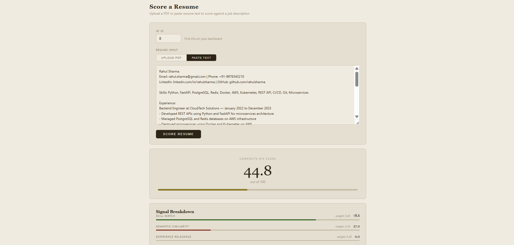
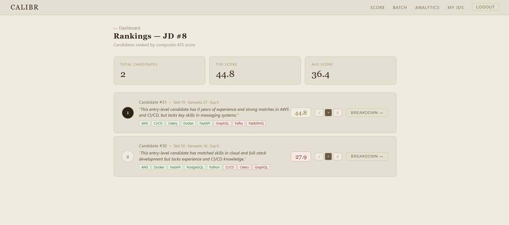
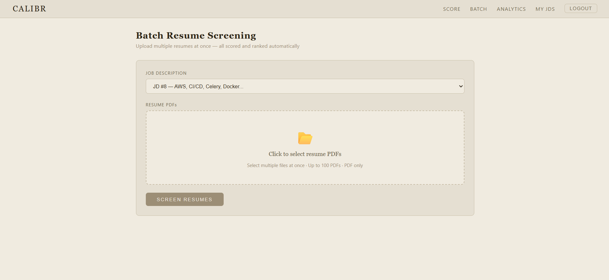
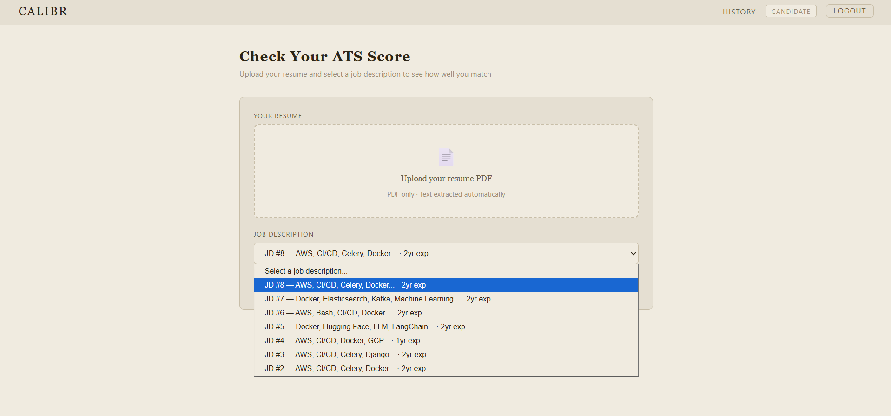
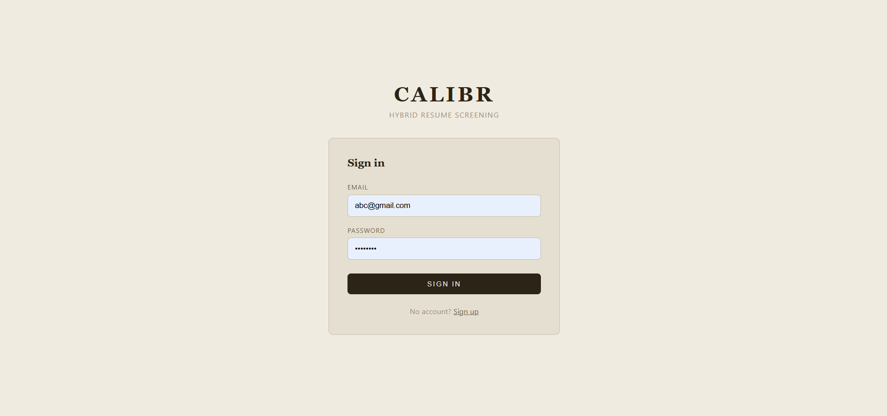

# Calibr — Hybrid Resume Screener & ATS Analyzer

> **Live Demo:** [calibr-two.vercel.app](https://calibr-two.vercel.app) · **API Docs:** [calibr-backend-8vq8.onrender.com/docs](https://calibr-backend-8vq8.onrender.com/docs)

Calibr is a full-stack AI-powered resume screening platform built for recruiters and candidates. It scores resumes using a **three-signal hybrid engine** — skill graph matching, semantic similarity, and experience relevance — and uses an LLM only for explanation, never for scoring decisions.

---

## Screenshots

### Recruiter Dashboard


### Score Results


### Rankings


### Batch Resume Screening


### Candidate Dashboard


### Login


---

## The Core Architecture Decision

Most AI resume screeners let the LLM decide the score. Calibr does not.

**Your code computes the score. The LLM only explains it.**

```
Resume + JD
    │
    ├── Signal 1: Skill Graph Match      (weight: 0.45)
    │   └── Exact match + synonym taxonomy (200+ synonyms)
    │
    ├── Signal 2: Semantic Similarity    (weight: 0.35)
    │   └── Sentence-Transformers (all-MiniLM-L6-v2)
    │
    └── Signal 3: Experience Relevance   (weight: 0.20)
        └── Recency decay + duration weighting
            │
            ▼
    Weighted Composite Score (0–100)
            │
            ▼
    Groq LLM (llama-3.1-8b-instant)
    └── Explains the pre-computed score
        Never changes it
```

This makes the scoring **auditable, consistent, and explainable** — the same resume against the same JD always gets the same score.

---

## Performance

| Metric | Value |
|--------|-------|
| 20 resumes scored | **0.46 seconds** |
| Per resume | **0.02 seconds** |
| Weights validated | **5/5 gold-set agreement** |
| Skill taxonomy | **200+ synonyms across 15 categories** |

---

## Features

### Recruiter Features
- **JD Upload** — paste job description, auto-parses required skills and experience years
- **Single Resume Scoring** — upload PDF or paste text, full three-signal breakdown
- **Batch Screening** — upload 100+ PDFs, Celery processes asynchronously with live progress bar
- **Rankings** — all candidates sorted by composite score with AI one-line summaries
- **Score Breakdown** — per-signal analysis showing exactly why each candidate ranked where they did
- **AI Interview Questions** — 3 technical + 2 gap + 2 behavioral questions tailored to each candidate's profile
- **Skill Gap Analysis** — per-missing-skill learning resource recommendations
- **Recruiter Notes & Shortlisting** — shortlist/pending/reject status + private notes per candidate
- **Analytics Dashboard** — total candidates, avg score, hiring funnel, skill distribution, top 5 candidates

### Candidate Features
- **ATS Score Check** — upload PDF resume, full extraction (name, email, phone, skills, experience, projects, certifications)
- **JD Dropdown** — select from all available job descriptions
- **Score + Breakdown** — composite score, signal bars, matched/missing skills, personalized feedback
- **Skill Gap Resources** — Groq suggests learning resources for each missing skill
- **Interview Prep** — questions you're likely to be asked based on your profile
- **ATS Resume Optimizer** — bullet rewrites, missing keywords, priority action plan
- **Score History** — all previous attempts with stats and trend

---

## Tech Stack

### Backend
| Layer | Technology |
|-------|-----------|
| API Framework | FastAPI |
| Database | PostgreSQL (Neon serverless) |
| ORM | SQLAlchemy |
| Task Queue | Celery 5.3.6 |
| Message Broker | Redis (Upstash) |
| NLP | spaCy (en_core_web_sm) |
| Similarity | Sentence-Transformers (all-MiniLM-L6-v2) |
| LLM | Groq API (llama-3.1-8b-instant) |
| PDF Extraction | pdfplumber + PyPDF2 |
| Auth | JWT (python-jose) + bcrypt |
| Rate Limiting | slowapi |

### Frontend
| Layer | Technology |
|-------|-----------|
| Framework | React 19 + Vite |
| Routing | React Router v6 |
| HTTP Client | Axios |
| Styling | Inline CSS (sepia newspaper theme) |

### Infrastructure
| Service | Provider |
|---------|---------|
| Backend | Render (Docker) |
| Frontend | Vercel |
| Database | Neon PostgreSQL |
| Redis | Upstash |
| Container | Docker |

---

## API Endpoints

| Method | Endpoint | Description |
|--------|----------|-------------|
| POST | `/auth/signup` | Create recruiter or candidate account |
| POST | `/auth/login` | Login, returns JWT access + refresh token |
| GET | `/auth/me` | Get current user info |
| POST | `/jd` | Upload job description (auto-parses skills) |
| GET | `/jd` | List recruiter's JDs |
| GET | `/jd/public/all` | All JDs (for candidate dropdown) |
| POST | `/score` | Score one resume against a JD |
| POST | `/upload/resume` | Extract text + structured data from PDF |
| POST | `/batch/score` | Submit batch of resumes (Celery async) |
| GET | `/batch/status/{job_id}` | Poll batch job progress |
| GET | `/rankings/{jd_id}` | Ranked candidates for a JD |
| GET | `/candidates/{id}/breakdown` | Full signal breakdown for one candidate |
| PATCH | `/candidates/{id}/status` | Shortlist / reject / pending |
| PATCH | `/candidates/{id}/notes` | Add recruiter notes |
| GET | `/interview/{candidate_id}` | AI-generated interview questions |
| GET | `/skill-gap/{candidate_id}` | Skill gap with learning resources |
| GET | `/improve/{candidate_id}` | ATS resume improvement suggestions |
| GET | `/analytics` | Recruiter analytics dashboard data |
| GET | `/history` | Score history |

---

## Scoring Formula

```
Composite Score = (Skill Score × 0.45) + (Semantic Score × 0.35) + (Experience Score × 0.20)
```

**Signal 1 — Skill Match (45%)**
Compares extracted resume skills against JD required skills using a hand-curated synonym taxonomy (e.g. "ML" = "Machine Learning" = "Artificial Intelligence"). Returns percentage of JD skills matched.

**Signal 2 — Semantic Similarity (35%)**
Neural semantic embeddings using Sentence-Transformers (all-MiniLM-L6-v2). Encodes resume and JD into dense vector representations and computes cosine similarity to capture meaning beyond keyword overlap.

**Signal 3 — Experience Relevance (20%)**
Compares total experience months against JD required years. Applies recency decay — recent experience weighted higher than older experience.

**Weights were validated** against a 5-candidate gold set with 5/5 agreement before deployment.

---

## Security

- JWT access tokens (30 min expiry) + refresh tokens (7 days)
- bcrypt password hashing
- IDOR prevention — every endpoint verifies `owner_id` matches JWT user
- Rate limiting: 10 req/min on `/score` and `/auth/login`
- Secrets in environment variables, never hardcoded
- `pip-audit` clean — zero known vulnerabilities in dependencies

---

## Local Setup

### Prerequisites
- Python 3.11+
- Node.js 18+
- Redis (Docker: `docker run -d -p 6379:6379 redis:alpine`)

### Backend

```bash
# Clone
git clone https://github.com/GYatharth/Calibr.git
cd Calibr

# Virtual environment
python -m venv venv
venv\Scripts\activate  # Windows
source venv/bin/activate  # Mac/Linux

# Install dependencies
pip install -r requirements.txt
python -m spacy download en_core_web_sm

# Environment variables
cp .env.example .env
# Fill in: DATABASE_URL, GROQ_API_KEY, SECRET_KEY, REDIS_URL

# Run API
uvicorn main:app --reload

# Run Celery worker (separate terminal)
celery -A app.celery_app worker --loglevel=info --pool=solo
```

### Frontend

```bash
cd frontend
npm install
npm run dev
```

Open `http://localhost:5173`

---

## Environment Variables

| Variable | Description |
|----------|-------------|
| `DATABASE_URL` | Neon PostgreSQL connection string |
| `GROQ_API_KEY` | Groq API key for LLM explanations |
| `SECRET_KEY` | JWT signing secret |
| `REDIS_URL` | Redis connection URL (Upstash in production) |

---

## Project Structure

```
Calibr/
├── app/
│   ├── api/                         # FastAPI routers
│   │   ├── auth_router.py           # Signup, login, JWT
│   │   ├── jd_router.py             # JD upload + listing
│   │   ├── scoring_router.py        # Single resume scoring
│   │   ├── batch_router.py          # Batch upload + status
│   │   ├── rankings_router.py       # Candidate rankings
│   │   ├── candidate_router.py      # Score breakdown
│   │   ├── interview_router.py      # Interview questions
│   │   ├── skill_gap_router.py      # Skill gap analysis
│   │   ├── resume_improve_router.py # ATS optimizer
│   │   ├── analytics_router.py      # Recruiter analytics
│   │   ├── history_router.py        # Score history
│   │   ├── upload_router.py         # PDF extraction
│   │   └── notes_router.py          # Notes + shortlisting
│   ├── db/
│   │   ├── models.py                # SQLAlchemy models
│   │   └── database.py              # DB connection
│   ├── scoring/
│   │   ├── skill_match.py           # Signal 1
│   │   ├── semantic_similarity.py   # Signal 2
│   │   ├── experience_score.py      # Signal 3
│   │   ├── composite_score.py       # Weighted combination
│   │   └── explainer.py             # LLM explanation + AI features
│   ├── parsing/
│   │   ├── extract_pdf.py           # PDF text extraction
│   │   ├── parse_jd.py              # JD skill parsing
│   │   └── parse_resume.py          # Resume structured parsing
│   ├── celery_app.py                # Celery configuration
│   └── tasks.py                     # Async batch scoring task
├── frontend/
│   └── src/
│       ├── pages/                   # React pages
│       │   ├── Login.jsx
│       │   ├── Signup.jsx
│       │   ├── Dashboard.jsx
│       │   ├── Score.jsx
│       │   ├── Batch.jsx
│       │   ├── Rankings.jsx
│       │   ├── Breakdown.jsx
│       │   ├── Analytics.jsx
│       │   ├── CandidateDashboard.jsx
│       │   └── History.jsx
│       ├── components/
│       │   └── Layout.jsx
│       └── api/
│           └── client.js            # Axios + JWT interceptors
├── Dockerfile
├── requirements.txt
├── main.py
└── config.json                      # Scoring weights
```

---

## Built With

**Python 3.11 · FastAPI · PostgreSQL · Redis · Celery · React 19 · Vite · Docker · Render · Vercel · Groq API · spaCy · Sentence-Transformers · pdfplumber**

---

*Built by Yatharth Gupta — BTech CSE at SRMIST*
*GitHub: [GYatharth](https://github.com/GYatharth) · Project: [GYatharth/Calibr](https://github.com/GYatharth/Calibr)*